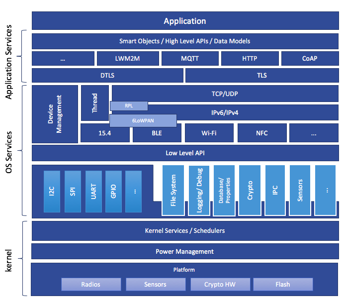
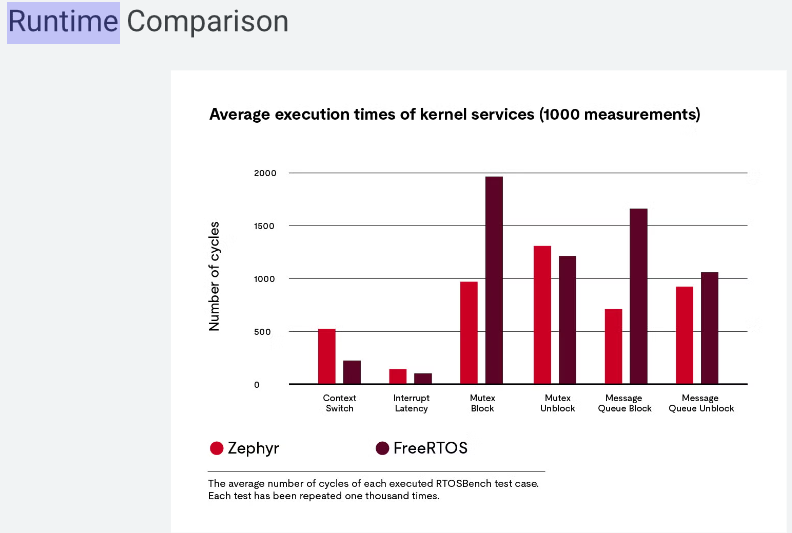

# Zephyr RTOS — Embedded Systems Guide

<p align="center">
  
</p>

<p align="center">
  <b>A Professional Guide to Zephyr RTOS for Embedded Systems and IoT</b>
</p>

<p align="center">
  
  
  
  
</p>

---

## Table of Contents

- [1. What is Zephyr RTOS?](#1-what-is-zephyr-rtos)
- [2. Why Use an RTOS?](#2-why-use-an-rtos)
- [3. Why Zephyr?](#3-why-zephyr)
- [4. Zephyr Architecture](#4-zephyr-architecture)
- [5. Kernel](#5-kernel)
- [6. Threads](#6-threads)
- [7. Scheduling](#7-scheduling)
- [8. Cooperative vs Preemptive Threads](#8-cooperative-vs-preemptive-threads)
- [9. Interrupts](#9-interrupts)
- [10. Timers](#10-timers)
- [11. Synchronization](#11-synchronization)
- [12. Memory Management](#12-memory-management)
- [13. Device Drivers](#13-device-drivers)
- [14. Device Tree](#14-device-tree)
- [15. Kconfig](#15-kconfig)
- [16. Kconfig vs Device Tree](#16-kconfig-vs-device-tree)
- [17. West](#17-west)
- [18. Multi-Architecture Support](#18-multi-architecture-support)
- [19. Bluetooth](#19-bluetooth)
- [20. Networking](#20-networking)
- [21. USB](#21-usb)
- [22. Filesystems](#22-filesystems)
- [23. Logging](#23-logging)
- [24. DFU](#24-dfu)
- [25. Security](#25-security)
- [26. Memory Protection](#26-memory-protection)
- [27. Tickless Kernel](#27-tickless-kernel)
- [28. SMP and AMP](#28-smp-and-amp)
- [29. Modularity and Scalability](#29-modularity-and-scalability)
- [30. Zephyr vs Bare Metal](#30-zephyr-vs-bare-metal)
- [31. Zephyr vs FreeRTOS](#31-zephyr-vs-freertos)
- [32. Example Project](#32-example-project)
- [33. Typical Zephyr Workflow](#33-typical-zephyr-workflow)
- [34. Useful Resources](#34-useful-resources)
- [35. License](#34-license)

---


# 1. What is Zephyr RTOS?

[Zephyr](https://www.zephyrproject.org/) is an open-source, scalable, modular, real-time operating system designed primarily for resource-constrained embedded systems and IoT devices.

It is hosted as a collaborative project by the [Linux Foundation](https://www.linuxfoundation.org/).

Zephyr provides a complete embedded software ecosystem including:

- Real-time kernel
- Thread management
- Scheduling
- Interrupt handling
- Synchronization primitives
- Device drivers
- Device Tree
- Kconfig
- Bluetooth
- Networking
- USB
- Filesystems
- Logging
- Firmware update mechanisms
- Memory protection
- Security mechanisms
- Multi-architecture support
- Build and dependency management through West

---

# 2. Why Use an RTOS?

In a simple bare-metal application, the main program may look like:

```c
while (1)
{
    read_sensor();
    control_motor();
    check_button();
    send_data();
}
```

##### As the system becomes more complex, this approach becomes difficult to maintain.

>                 Embedded Application
>                        |
>         +--------------+--------------+
>         |              |              |
>        Sensor Task    Motor Task    Communication
>             |             |              |
>             +-------------+--------------+
>                           |
>                          MCU

##### An RTOS provides the mechanisms needed to manage these activities independently.

###### Typical RTOS responsibilities include:

- Task/thread scheduling
- Timing
- Synchronization
- Inter-thread communication
- Resource management
- Interrupt handling
- Memory management

---

## 3. Why Zephyr?

Zephyr is designed specifically for modern embedded systems.

### Major advantages

| Feature            | Description                                   |
| ------------------ | --------------------------------------------- |
| Open Source        | Apache 2.0 licensed                           |
| Real-Time          | Designed for deterministic embedded workloads |
| Modular            | Enable only the features you need             |
| Scalable           | Supports small MCUs and larger systems        |
| Multi-Architecture | ARM, RISC-V, x86 and others                   |
| Device Drivers     | Unified driver model                          |
| Bluetooth          | BLE and Bluetooth functionality               |
| Networking         | IPv4, IPv6, TCP, UDP, CoAP, Thread, etc.      |
| USB                | USB subsystem                                 |
| Filesystems        | Storage and filesystem support                |
| Security           | Multiple security mechanisms                  |
| Kconfig            | Flexible software configuration               |
| Device Tree        | Hardware description                          |
| West               | Workspace and build management                |

# 4. Zephyr Architecture

A simplified Zephyr architecture looks like this:

```
+--------------------------------------------------+
|                  Application                     |
|                                                  |
|  Sensor Application | Motor Control | BLE App    |
+--------------------------------------------------+
|                 Zephyr Subsystems                |
|                                                  |
|  Bluetooth | Networking | USB | Filesystem       |
|  Logging   | Sensors    | Storage | DFU          |
+--------------------------------------------------+
|                   Zephyr Kernel                  |
|                                                  |
| Threads | Scheduler | Timers | IPC | Memory      |
+--------------------------------------------------+
|                Device Driver Layer               |
|                                                  |
| GPIO | I2C | SPI | UART | PWM | ADC | Sensor     |
+--------------------------------------------------+
|                Hardware / HAL                    |
+--------------------------------------------------+
|                     MCU                          |
+--------------------------------------------------+
```

The application normally interacts with Zephyr APIs instead of accessing hardware registers directly.

---

# 5. Kernel

The Zephyr kernel is responsible for the fundamental operating-system functionality.

Important kernel components include:

- Threads
- Scheduler
- Interrupts
- Timers
- Semaphores
- Mutexes
- Message queues
- FIFOs
- Memory management
- Work queues

The kernel provides the foundation on which the rest of the system is built.

---

# 6. Threads

A thread is an independently scheduled execution context.

For example, an embedded robot might contain:

```
+---------------------+
| Sensor Thread       |
| Read IMU            |
+---------------------+

+---------------------+
| Motor Thread        |
| Control motors      |
+---------------------+

+---------------------+
| Communication       |
| Send telemetry      |
+---------------------+
```

##### A simplified Zephyr thread:

```c
#include <zephyr/kernel.h>

#define STACK_SIZE 1024
#define PRIORITY   5

void sensor_thread(void *arg1,
                   void *arg2,
                   void *arg3)
{
    while (1)
    {
        printk("Reading sensor...\n");

        k_sleep(K_MSEC(100));
    }
}

K_THREAD_DEFINE(
    sensor_tid,
    STACK_SIZE,
    sensor_thread,
    NULL,
    NULL,
    NULL,
    PRIORITY,
    0,
    0
);
```

##### The thread:

1. Executes its task.
2. Sleeps for 100 ms.
3. Becomes ready again.
4. The scheduler decides when it runs.

---

# 7. Scheduling

The scheduler decides which ready thread should execute.

For example:

```
Priority
   |
   | 1   Motor Control
   |
   | 3   Sensor
   |
   | 5   Communication
   |
   | 7   Logging
   |
   +----------------------> Lower priority
```

If a higher-priority thread becomes ready, the scheduler can switch execution to it depending on the scheduling configuration.

This is essential for real-time systems.

---

# 8. Cooperative vs Preemptive Threads

Zephyr supports both cooperative and preemptive scheduling models.

## Cooperative Thread

A cooperative thread normally keeps executing until it:

- Sleeps
- Waits
- Blocks
- Explicitly yields

Conceptually:

```
Cooperative Thread
       |
       +---- Running
       |
       +---- Sleep
       |
       +---- Wait
       |
       +---- Yield
```

## Preemptive Thread

A preemptive thread can be interrupted by a higher-priority ready thread.

```
Low Priority
     |
     | Running
     |
     +---------> Preempted
                    |
                    v
             High Priority
                 Thread
                    |
                    v
             Low Priority
                 resumes
```

This is particularly useful for real-time applications.

---

# 9. Interrupts

Interrupts allow hardware to notify the CPU that an event has occurred.

Examples:

- GPIO edge
- UART reception
- Timer event
- SPI transfer complete
- ADC conversion complete
- Sensor interrupt

Typical flow:

```
Hardware Event
      |
      v
Interrupt Controller
      |
      v
ISR
      |
      v
Process Event
```

The ISR should normally be short and should avoid long blocking operations.

A common architecture is:

```
ISR
 |
 +--> Capture event
 |
 +--> Signal thread
          |
          v
       Thread
          |
          +--> Perform processing
```

---

# 10. Timers

Timers allow code to execute or trigger events after a specific amount of time.

For example:

```c
k_sleep(K_MSEC(100));
```

means:

```
Sleep
  |
100 ms
  |
Wake
```

Periodic execution:

```
Sensor Thread
      |
      v
 Read Sensor
      |
    Sleep
   100 ms
      |
      v
 Read Sensor
      |
    Sleep
   100 ms
      |
      v
    ...
```

##### Timers are important for:

- Sensor sampling

- Motor control

- Timeouts

- Periodic communication

- Power management

  ---

  # 11. Synchronization

  Multiple threads may access the same resource.

  Example:

  ```
  Thread A ----+
               |
               v
            Shared Data
               ^
               |
  Thread B ----+
  ```

  

Without synchronization, race conditions may occur.

Zephyr provides synchronization primitives such as:

- Mutexes
- Semaphores
- Events
- Spinlocks
- FIFOs
- Message queues

### Mutex

A mutex protects shared resources.

Conceptually:

```
Thread A
   |
 Lock Mutex
   |
 Access Resource
   |
 Unlock Mutex
```

While another thread waits:

```
Thread B
   |
 Wait for Mutex
   |
   v
  Block
```

---

# 12. Memory Management

Embedded systems have limited RAM and Flash.

Zephyr provides multiple memory-management mechanisms.

##### Important concepts include:

- Thread stacks
- Memory pools
- Heaps
- Memory domains
- Static allocation
- Userspace memory protection

A typical embedded design tries to avoid unnecessary dynamic memory allocation.

For example:

```
RAM
+-----------------------+
| Kernel                |
+-----------------------+
| Thread Stack          |
+-----------------------+
| Thread Stack          |
+-----------------------+
| Buffers               |
+-----------------------+
| Application Data      |
+-----------------------+
```

Static allocation makes resource usage more predictable.

---

# 13. Device Drivers

Zephyr provides a unified device-driver model.

Instead of directly accessing MCU registers:

```c
GPIO_REGISTER
GPIO_OUTPUT
GPIO_SET
```

the application can use Zephyr APIs.

Conceptually:

```
Application
     |
     v
Zephyr API
     |
     v
Device Driver
     |
     v
MCU Hardware
```

##### Examples of supported hardware interfaces include:

- GPIO
- UART
- I2C
- SPI
- PWM
- ADC
- DAC
- Sensors
- Flash
- Ethernet
- CAN
- USB

This abstraction improves portability.

---

# 14. Device Tree

Device Tree describes the hardware configuration.

It answers questions such as:

> What hardware exists?

> Where is it connected?

> Which controller does it use?

For example:

```
STM32
 |
 +-- I2C1
 |     |
 |     +-- MPU9250
 |
 +-- SPI1
 |     |
 |     +-- Display
 |
 +-- UART1
       |
       +-- Communication Module
```

A simplified Device Tree concept:

```dtd
&i2c1 {
    status = "okay";

    sensor@68 {
        compatible = "example,imu";
        reg = <0x68>;
    };
};
```

The exact binding and properties depend on the device and Zephyr support.

---

------

# 15. Kconfig

Kconfig controls software configuration.

It answers:

> Which software features should be enabled?

For example:

```c
CONFIG_GPIO=y
CONFIG_I2C=y
CONFIG_SENSOR=y
CONFIG_BT=y
CONFIG_LOG=y
```

Conceptually:

```
Kconfig
   |
   +-- GPIO       ON
   +-- I2C        ON
   +-- Bluetooth  ON
   +-- Logging    ON
   +-- Wi-Fi      OFF
```

Kconfig helps keep the firmware optimized for the target application.

---

# 16. Kconfig vs Device Tree

This distinction is extremely important.

| Kconfig                | Device Tree                          |
| ---------------------- | ------------------------------------ |
| Software configuration | Hardware description                 |
| Enables features       | Describes hardware                   |
| `CONFIG_BT=y`          | Describes Bluetooth-related hardware |
| `CONFIG_I2C=y`         | Describes I2C controller/device      |
| Controls build options | Defines hardware relationships       |

A simple mental model:

```
           Zephyr Project
                 |
        +--------+--------+
        |                 |
     Kconfig          Device Tree
        |                 |
        v                 v
 Software Features     Hardware
        |                 |
        +--------+--------+
                 |
              Build
                 |
              Firmware
```

### Remember

> **Kconfig = What software do I want?**

> **Device Tree = What hardware do I have and how is it connected?**

---

17. West

West is Zephyr's meta-tool for managing workspaces and multiple repositories.

A typical workflow:

```bash
west init
west update
west build
west flash
west debug
```

##### Initialize a workspace

```bash
west init ~/zephyrproject
```

##### Download/update repositories

```bash
cd ~/zephyrproject
west update
```

##### Build

```bash
west build -b <board> <application>
```

##### Flash

```bash
west flash
```

##### Debug

```bash
west debug
```

West is especially useful because Zephyr consists of multiple repositories and dependencies.

---

# 18. Multi-Architecture Support

Zephyr is designed to support multiple CPU architectures.

Examples include:

```
ARM
RISC-V
x86
ARC
Xtensa
```

This allows developers to use similar Zephyr concepts across different hardware platforms.

For example:

```
             Application
                  |
               Zephyr
                  |
        +---------+---------+
        |         |         |
      ARM      RISC-V     x86
```

This improves portability and reduces vendor lock-in.

---

19. Bluetooth

Zephyr provides Bluetooth and Bluetooth Low Energy support.

BLE is particularly useful for low-power embedded devices.

Example:

```
+-------------+
|   Sensor    |
|   Device    |
+-------------+
       |
       | BLE
       |
       v
+-------------+
| Smartphone  |
+-------------+
```

##### Possible applications include:

- Wearables
- Sensors
- Smart home devices
- Beacons
- Industrial monitoring
- Medical devices
- IoT nodes

Zephyr also supports Bluetooth Mesh use cases.

---

# 20. Networking

Zephyr includes networking capabilities for embedded systems.

##### Examples include:

- IPv4
- IPv6
- TCP
- UDP
- Ethernet
- 6LoWPAN
- CoAP
- Thread

Example:

```
Sensor
   |
   v
Zephyr
   |
   v
Wi-Fi / Ethernet / Thread
   |
   v
Network
   |
   v
Cloud Server
```

This allows a small MCU-based system to communicate with other devices and cloud services.

---

# 21. USB

Zephyr includes USB subsystem support.

Possible applications include:

```
MCU
 |
 +-- USB CDC ACM
 |
 +-- USB HID
 |
 +-- USB Mass Storage
 |
 +-- Other USB classes
```

For example, a development board can expose a virtual serial port:

```
PC
 |
 | USB
 v
Zephyr Device
 |
 +-- UART-like communication
```

---

# 22. Filesystems

Embedded devices sometimes need persistent storage.

For example:

```
Application
     |
     v
Filesystem
     |
     v
Flash / SD Card / External Storage
```

##### Possible use cases:

- Configuration files
- Sensor logs
- Audio files
- Firmware images
- Device state

Zephyr provides filesystem and storage-related subsystems.

---

# 23. Logging

Logging is essential during embedded development.

Instead of relying only on:

```c
printk("Error\n");
```

Zephyr provides a configurable logging subsystem.

Conceptually:

```
Application
    |
    v
Logging API
    |
    +---- UART
    |
    +---- RTT
    |
    +---- Console
    |
    +---- Other backend
```

Logging levels may include:

```
ERROR
WARNING
INFO
DEBUG
```

This makes debugging large embedded applications easier.

----

# 24. DFU

DFU stands for:

> Device Firmware Update

It allows firmware to be updated after the product has been deployed.

Typical flow:

```
New Firmware
     |
     v
Download
     |
     v
Verify
     |
     v
Flash
     |
     v
Reboot
     |
     v
New Firmware
```

##### DFU is especially important for:

- IoT
- Industrial devices
- Connected sensors
- Commercial products

because devices may need security patches or new features after deployment.

---

# 25. Security

Security is important in connected embedded devices.

Zephyr's security approach includes areas such as:

- Secure development practices
- Code review
- Static analysis
- Fuzz testing
- Penetration testing
- Threat modeling
- Vulnerability response
- Memory protection

A secure embedded system should consider:

```
+--------------------------+
|       Application        |
+--------------------------+
|      Security APIs       |
+--------------------------+
|     Memory Protection    |
+--------------------------+
|     Secure Boot / DFU    |
+--------------------------+
|          MCU             |
+--------------------------+
```

Security should be considered during architecture and development rather than added only at the end.

---

# 26. Memory Protection

Memory protection helps prevent one part of the system from accessing memory it should not access.

Conceptually:

```
+---------------------------+
|        Kernel             |
|      Privileged           |
+---------------------------+
|       Userspace           |
|      Restricted           |
+---------------------------+
|        Hardware           |
+---------------------------+
```

##### Possible protections include:

- Stack protection
- Thread isolation
- Object permissions
- Device permissions
- Userspace

This helps contain software faults and security vulnerabilities.

---

# 27. Tickless Kernel

Traditional periodic scheduling may use a regular system tick:

```
Tick   Tick   Tick   Tick   Tick
 |      |      |      |      |
 v      v      v      v      v
```

A tickless system can sleep until an actual event is expected:

```
RUN
 |
 v
SLEEP -------------------------+
                               |
                            EVENT
                               |
                               v
                              RUN
```

##### Advantages include:

- Lower CPU activity
- Lower power consumption
- Better battery life
- Efficient low-power operation

This is particularly valuable for IoT and battery-powered devices.

---

# 28. SMP and AMP

## SMP

SMP stands for:

> Symmetric Multiprocessing

Multiple CPU cores are managed by the same operating system.

```
       Zephyr
          |
    +-----+-----+
    |           |
  CPU 0       CPU 1
```

Both cores can execute application workloads.

---

## AMP

AMP stands for:

> Asymmetric Multiprocessing

Different processors or cores can have different responsibilities.

```
CPU 0
 |
 +-- Application

CPU 1
 |
 +-- Real-Time Processing
```

This is useful in heterogeneous embedded systems.

---

# 29. Modularity and Scalability

One of Zephyr's main design goals is modularity.

You can create a small system:

```
GPIO
UART
Timer
Kernel
```

or a much larger connected system:

```
Kernel
 |
 +-- Bluetooth
 +-- Wi-Fi
 +-- Networking
 +-- USB
 +-- Filesystem
 +-- Sensors
 +-- Security
 +-- DFU
```

The goal is to include only what the application needs.

##### This helps manage:

- Flash
- RAM
- CPU usage
- Complexity
- Build time

---

# 30. Zephyr vs Bare Metal

#### Bare Metal

```
Application
     |
     v
MCU Registers
     |
     v
Hardware
```

##### Advantages:

- Very low overhead
- Simple for small applications
- Direct hardware control

##### Disadvantages:

- Difficult to scale
- Manual scheduling
- More difficult concurrency
- More application-specific code

---

#### Zephyr

```
Application
     |
     v
Zephyr APIs
     |
     v
Kernel + Drivers
     |
     v
Hardware
```

##### Advantages:

- Thread management
- Scheduling
- Drivers
- Networking
- Bluetooth
- Security
- Portability
- Better architecture for complex systems

---

# 31. Zephyr vs FreeRTOS

Both are popular embedded RTOS solutions.

| Feature                 | Zephyr               | FreeRTOS                                  |
| ----------------------- | -------------------- | ----------------------------------------- |
| Kernel                  | Yes                  | Yes                                       |
| Open Source             | Yes                  | Yes                                       |
| Threads/Tasks           | Yes                  | Yes                                       |
| Scheduling              | Yes                  | Yes                                       |
| Synchronization         | Yes                  | Yes                                       |
| Device Tree             | Yes                  | Not a core concept                        |
| Kconfig                 | Yes                  | Common in some ecosystems/projects        |
| Integrated Drivers      | Extensive ecosystem  | Usually more platform/vendor dependent    |
| Networking              | Integrated ecosystem | Available through ecosystem/components    |
| Bluetooth               | Integrated ecosystem | Usually via additional stacks/integration |
| USB                     | Integrated ecosystem | Available through ecosystem               |
| West                    | Yes                  | No equivalent core tool                   |
| Multi-architecture      | Yes                  | Yes                                       |
| Modularity              | Very high            | High                                      |
| Full embedded ecosystem | Strong               | Strong kernel ecosystem                   |

The important conceptual difference is:

```
FreeRTOS
   |
   +-- Strong RTOS Kernel
   |
   +-- Add components/ecosystem as needed


Zephyr
   |
   +-- Kernel
   +-- Drivers
   +-- Device Tree
   +-- Kconfig
   +-- Networking
   +-- Bluetooth
   +-- USB
   +-- Filesystems
   +-- Security
   +-- West
   +-- Testing
```

This is a simplified comparison; the capabilities of either ecosystem depend on the target platform and components selected.


---

# 32. Example Project

Consider an embedded sensor device using:

```
STM32
 |
 +-- MPU9250       → I2C
 |
 +-- Status LED    → GPIO
 |
 +-- Debug UART    → UART
 |
 +-- BLE           → Bluetooth
```

The architecture could be:

```
                   Application
                       |
          +------------+------------+
          |            |            |
      Sensor Task   BLE Task    Status Task
          |            |            |
          +------------+------------+
                       |
                  Zephyr Kernel
                       |
          +------------+------------+
          |            |            |
         I2C          BLE          GPIO
          |            |            |
       MPU9250       Radio          LED
```

---

# 32. Typical Zephyr Workflow

A typical development workflow looks like:

```
                    Start
                      |
                      v
               Create Workspace
                      |
                      v
                  west init
                      |
                      v
                 west update
                      |
                      v
              Create Application
                      |
                      v
               Configure Kconfig
                      |
                      v
             Configure Device Tree
                      |
                      v
                 west build
                      |
                      v
                   Flash
                      |
                      v
                   Debug
                      |
                      v
                  Test
                      |
                      v
                  Optimize
```

##### Typical commands:

```bash
west init ~/zephyrproject
cd ~/zephyrproject
west update
```

##### Build:

```bash
west build -b <board> <application>
```

##### Flash:

```bash
west flash
```

##### Debug:

```bash
west debug
```

---

# Quick Reference

## The Big Picture

```
                       ZEHPYR RTOS
                           |
        +------------------+------------------+
        |                  |                  |
      Kernel            Subsystems         Drivers
        |                  |                  |
   +----+----+       +-----+------+      +----+----+
   |         |       |            |      |         |
Threads   Scheduler  BLE       Network   GPIO     I2C
   |         |       |            |      SPI      SPI
Timers   Interrupts USB       TCP/IP    UART     PWM
   |         |       |            |      ADC      CAN
   +---------+-------+------------+------+---------+
                           |
                      Device Tree
                           |
                       Hardware
                           |
                         MCU
```

---

# Final Mental Model

The easiest way to understand Zephyr is:

```
                 APPLICATION
                      |
          "What does my product do?"
                      |
                      v
                  ZEPHYR APIs
                      |
        +-------------+-------------+
        |             |             |
      Kernel       Drivers      Subsystems
        |             |             |
   Threads       GPIO/I2C      Bluetooth
   Scheduler     SPI/UART      Networking
   Timers        PWM/ADC       USB
   Mutexes       Sensors       Filesystem
   Semaphores    CAN           Logging
        |             |             |
        +-------------+-------------+
                      |
                      v
                DEVICE TREE
                      |
             "What hardware exists?"
                      |
                      v
                     MCU
```

# 33. Useful Resources

## Official Documentation

- [Zephyr Project](https://www.zephyrproject.org/)
- [Zephyr Documentation](https://docs.zephyrproject.org/latest/)
- [Zephyr GitHub Repository](https://github.com/zephyrproject-rtos/zephyr)
- [Getting Started Guide](https://docs.zephyrproject.org/latest/develop/getting_started/index.html)
- [Supported Boards](https://docs.zephyrproject.org/latest/boards/index.html)
- [Samples and Demos](https://docs.zephyrproject.org/latest/samples/index.html)

---

## License

This documentation is intended as a learning reference.

Zephyr itself is an open-source project released under the Apache 2.0 license.

For the official project information, visit:

- https://www.zephyrproject.org/
- https://docs.zephyrproject.org/
- https://github.com/zephyrproject-rtos/zephyr